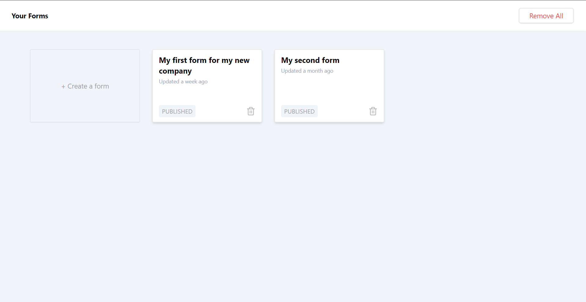
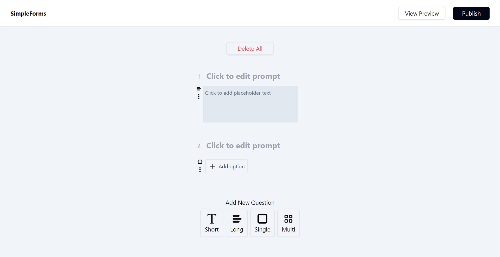

# Form Builder

Tired of complex survey tools like Google Forms? Here's my app for you!





## Tech stack

```
VUEJS 3(COMPOSITION API) + VUEX + TAILWINDCSS + DAISYUI + VITE + ESLINT + PRETTIER
```

## Figma

When making this app, I started from [this template](https://www.figma.com/community/file/847634156194273771/simpleform?searchSessionId=lsari9wg-yurmz56rq4p).

## Website

You can try my app on [Github pages](https://yoursaniki.github.io/Form-Builder-App/#/).

## Recommended IDE Setup

[VS Code](https://code.visualstudio.com/), [Volar](https://marketplace.visualstudio.com/items?itemName=Vue.volar), [Vite](https://vitejs.dev/).

## Customize Configuration

[Vite Configuration Settings](https://vitejs.dev/config/).

## Project Setup

```shell copy
npm install
```

## Compile and Hot-Reload for Development

```shell copy
npm run dev
```

## Compile and Minify for Production

```shell copy
npm run build
```
